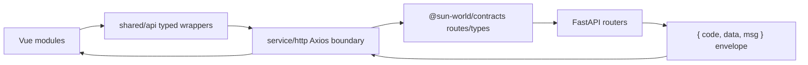

# Platform Iteration Roadmap

This document is the working roadmap for the monorepo platform after importing
the API into `apps/api`.

## Commit And Push Policy

Do not commit and push after every tiny edit.

Use this cadence instead:

1. Commit after a coherent, verified checkpoint.
   - Good checkpoints: API migration boundary, UI component library replacement,
     RUM monitoring endpoint, build-script optimization, API-entrypoint cleanup.
   - Each checkpoint should have docs or tests that explain the contract.
2. Push only when the branch is useful outside the local machine.
   - Push after local checks pass and the diff is reviewable.
   - Push earlier only for backup before a risky step or for handoff.
3. Never push secrets, `.env` values, certificates, private keys, local venvs,
   notebooks, caches, or generated runtime files.
4. If local and remote diverge, stop and report before merging or rebasing.
5. `main` remains the deploy branch. Risky work should use a short-lived
   `codex/*` or feature branch and merge after verification.

## Frontend Backend Chain

Current intended request path:

Operational correlation:

- The frontend HTTP boundary adds `X-Request-ID`.
- Backend middleware validates or generates the request ID.
- Backend responses echo `X-Request-ID`.
- Frontend API timing and API error telemetry include the same request ID.
- Admin request metrics and RUM telemetry are separate read models.

Rules for future work:

- New frontend business calls should use module-owned API functions over
  feature-local raw Axios calls.
- Frontend business code must not import `@/service/http` directly. Keep it
  behind `apps/web/src/shared/api` or a module-owned `api.ts` file.
- Shared route strings and response types should be added to
  `@sun-world/contracts` before UI code depends on them.
- Backend routes must return the common response envelope unless the route is
  explicitly operational, such as health probes.
- Cross-boundary behavior needs a small contract test or script, not only a
  manual browser check.

## Performance Monitoring Platform

Implemented baseline:

- Backend request metrics: `GET /admin/metrics`
- Backend request ID middleware and structured logging
- Frontend telemetry client with Web Vitals, route timing, API timing, and
  global error capture
- Admin metrics page for backend request metrics
- Web performance budget script

New RUM minimum viable platform:

- `POST /telemetry/events` ingests frontend telemetry events.
- `GET /admin/telemetry` exposes process-local RUM aggregate metrics.
- The admin metrics page displays RUM event cards, Web Vitals, and recent
  sanitized frontend events.
- Web Vitals snapshots include bounded-sample `p50_value`, `p95_value`, and
  `p99_value`.
- Backend request metrics include bounded-sample global and per-route
  `p50_duration_ms`, `p95_duration_ms`, and `p99_duration_ms`.
- Metrics snapshots have a replaceable persistence boundary in
  `apps/api/src/core/metrics_store.py`: default in-memory history, and optional
  single-node JSON snapshot history selected through `BLOG_METRICS_STORE=json`.
- Metrics alert thresholds have a local evaluator in
  `apps/api/src/core/metrics_alerts.py` for request error rate, request p95
  latency, and Web Vital poor rate.
- `apps/api/src/core/admin_alerts.py` assembles those local alert results into
  the authenticated `GET /admin/alerts` read model, and the admin metrics page
  displays active critical/warning alerts.
- `apps/api/src/core/metrics_history.py` exposes bounded request/RUM snapshot
  history through authenticated `GET /admin/metrics/history`, and the admin
  metrics page displays current history sample counts.
- Alert read-model assembly uses non-persisting request/RUM snapshot reads, so
  the admin page can refresh metrics, telemetry, and alerts together without
  writing duplicate snapshot history entries for the alert panel.
- `pnpm check:api` runs admin alert, admin metrics history, metrics alert,
  metrics store, request metrics, and RUM protocol checks.

Limitations:

- RUM and request metric aggregation is still process-local.
- JSON snapshot history is a single-node bridge, not a durable multi-instance
  analytics warehouse.
- Event-level Redis/Postgres retention is still not implemented.
- Production frontend delivery still requires a configured
  `VITE_TELEMETRY_ENDPOINT`.

Next monitoring iterations:

1. Persist RUM events into Redis or Postgres with retention.
2. Replace process-local aggregation and percentile samples with Redis/Postgres backed
   retention when production traffic needs historical analysis.
3. Add notification delivery for alert threshold results, and extend alerts to
   readiness probe failures when a channel is selected.
4. Add CI or release storage that preserves generated build manifests and
   build summaries over time for bundle size and budget trends.
5. Add OpenTelemetry `traceparent` propagation when external tracing is needed.

## Build, Runtime, And Packaging

Current state:

- `packages/ui` exposes subpath component entries so the app can import only
  used components.
- `pnpm check:web:ui-boundary` verifies the web app imports UI runtime
  components only through documented `@sun-world/ui/*` subpaths, verifies the
  package exports exist, rejects app root/internal UI imports, and rejects a
  shared `ui.*` web chunk.
- Root `pnpm check` runs `pnpm test:ui` and `pnpm build:ui` before the app
  frontend check, so UI component protocol tests and independent package
  outputs are verified separately from the consuming web bundle.
- `packages/contracts` owns OpenAPI-derived frontend/backend contracts.
- `packages/contracts` OpenAPI generation runs through
  `scripts/generate-openapi.mjs`, not bash, so Windows/local CI/server command
  paths use the same protocol.
- `docker-compose.yml` can build frontend only by default and API with the
  `api` profile.
- API checks avoid importing runtime managers and validate repository boundary
  safety.
- AI chat now goes through `apps/web/src/modules/ai/api.ts` and backend
  `/ai/*` route constants instead of browser-side LangChain/OpenAI clients.
- Backend AI image model imports are lazy at endpoint execution time, keeping
  router import/startup coupling lower.
- Route-only frontend dependencies are split out of global vendor when they
  belong to optional workflows. Current guarded chunks include
  `video-player` for Artplayer/HLS, `tile-export` for JSZip, and
  `vditor-preview` / `vditor-editor` for article read vs write workflows, and
  `admin-charts` for the admin chart tab shell. Legacy `src/pages` routes are
  no longer merged into the entry chunk; each remaining route shell is named
  explicitly, including `page-game-tiles`, `page-tools`, `page-keep`,
  `page-login`, `page-register`, `page-me`, `page-qq-callback`, and
  `manage-shell`.
- `pnpm check:web` generates and validates
  `apps/web/dist/build-manifest.json`, a machine-readable build artifact
  snapshot with total JS/CSS gzip, initial gzip, lazy JS gzip, and per-asset
  initial/lazy metadata.
- Production HTML strips preloads/stylesheets for route-only optional heavy
  chunks such as Element, admin manage shell, JSZip export, Vditor, ECharts,
  ZRender, video player, and legacy page chunks. The route chunks remain in
  `dist` and load when their dynamic route imports execute.

Near-term optimizations:

1. Keep UI components split by subpath exports and avoid app-level barrel
   imports for unused components.
2. Keep contracts generated from backend OpenAPI and committed with route
   constants/tests. Generate OpenAPI through the cross-platform
   `scripts/generate-openapi.mjs` wrapper.
3. Add Docker build args for public frontend API and telemetry endpoints.
4. Improve the frontend Dockerfile cache layout by copying lockfiles and
   package manifests before source code. (Implemented locally; guarded by
   `pnpm check:dockerfile`.)
5. Add module-level checks:
   - `pnpm check:contracts:usage`
   - `pnpm -F @sun-world/ui test`
   - `pnpm -F @sun-world/contracts test`
   - `pnpm -C apps/web exec vue-tsc --noEmit`
   - `pnpm -C apps/web build`
   - `pnpm check:api`
   - `pnpm check:compose`
   - `pnpm check:dockerfile`
6. Keep root build/check scripts cross-platform. Use Node wrappers for
   environment variables and orchestration instead of shell-specific syntax.
   `pnpm check` is the local/CI total check and runs through
   `scripts/check-all.mjs`; public health checks stay outside the default
   local check path. `pnpm check:platform` audits that the durable evidence for
   the platform goal remains present before the heavier checks run.
7. Keep retired internal API entrypoints deleted. `pnpm check:web:legacy-api`
   guards against reintroducing `apps/web/src/service/request.ts`,
   `apps/web/src/service/auth.req.ts`, `apps/web/src/service/manageRequest.ts`,
   `apps/web/src/service/user.req.ts`, `apps/web/src/hooks/auth/auth.ts`, or
   the old `apps/web/src/aigc` browser LangChain client and `/api/refresh`
   Axios path.
8. Keep route-only heavy dependencies out of global vendor. `pnpm
   check:web:chunks` verifies the `video-player` and `tile-export` chunks and
   rejects top-level JSZip imports in shared utilities. It also verifies
   Vditor preview/editor chunk separation and prevents catalog rendering from
   importing the full editor runtime. Admin chart guardrails prevent the manage
   shell from statically importing the chart tab or broadly preloading admin
   routes. Legacy page guardrails prevent broad `src/pages/**` manual chunk
   merging and account-wide route preloading.
9. Keep package UI primitives independent from Element Plus runtime. The
   shared UI package exposes stable component protocols and native
   implementations for the current primitive set. App-only Element Plus
   components remain route-owned until they receive a package protocol. The web
   chunk guard rejects global Element theme CSS, Element runtime imports from
   package UI components, and entry HTML preloads for route-only/heavy chunks.
   HTTP error messages lazy-load Element Message only when a notification is
   actually shown.
10. Keep build manifest generation after `pnpm -C apps/web build` so bundle
    trend data comes from the same dist output that budgets and chunk
    boundaries inspect.
11. Keep build summary generation after manifest validation. The summary is the
    compact artifact to retain in CI/release storage: top assets, totals, and
    machine-readable budget results.
12. Keep UI package imports and bundling minimal. App runtime code should use
    documented UI subpaths, not the package root or internal source paths, and
    web builds should not emit a shared `ui.*` chunk that drags unused package
    components into the entry path.
13. Keep UI package test/build in the root verification chain. Component
    protocols should fail independently before the app bundle masks a package
    regression.

## Five Hour Execution Plan

Work should stop after the current safe checkpoint once the 5 hour limit is
reached. Do not start a broad refactor near the end of the window.

### Iteration 1: Chain And RUM Baseline

- Add RUM metrics protocol test.
- Add backend in-memory RUM collector.
- Add `POST /telemetry/events`.
- Add authenticated `GET /admin/telemetry`.
- Regenerate OpenAPI and TypeScript contracts.
- Add admin RUM overview to the metrics page.
- Run API, contracts, type, build, and compose checks.

### Iteration 2: Build And Packaging

- Add frontend Docker build args for public API and telemetry endpoint.
- Keep default direct Docker build backward-compatible.
- Copy workspace package manifests before source code in the frontend
  Dockerfile so dependency installation can be cached across source-only
  changes.
- Add `scripts/check-docker-build-context.mjs` to keep Dockerfile manifest
  copies synchronized with workspace packages.
- Verify compose config locally or on the server without deployment.
- Replace shell-specific root build/check entrypoints with cross-platform Node
  wrappers.
- Delete unused legacy internal API entrypoints and guard them with
  `scripts/check-legacy-api-entrypoints.mjs`.
- Keep table and form UI components data-source agnostic. Module composables
  should inject typed fetch functions instead of letting UI components accept
  raw backend URL strings.
- Review `manualChunks` for modules that should stay lazy.
- Keep AI client calls in the module API boundary; do not reintroduce
  browser-side provider SDKs for server-owned AI workflows.
- Keep route constants aligned with backend OpenAPI. `API_ROUTE_METHODS` must
  cover every `API_ROUTES` value, and contracts tests verify every declared
  path/method exists in the generated OpenAPI schema.
- Keep `pnpm -F @sun-world/contracts generate:openapi` on the Node wrapper.
  `scripts/check-contracts-generate-script.mjs` rejects bash-backed contracts
  generation.
- Keep `saveTilesAsZip()` loading JSZip dynamically so opening the game tiles
  route does not eagerly download ZIP export code.
- Keep blog module preloading focused on public article reading. Do not warm
  `ArticleEditorPage` while serving `/blog`.
- Keep admin charts behind their selected tab. Do not statically import
  `AdminChartsPage` from the manage shell, and keep ECharts option-only files
  on type-only imports.
- Keep UI package primitives free of Element Plus runtime imports. If a future
  primitive needs richer behavior, add or revise the package protocol first and
  preserve behavior with package-level tests.
- Keep Vite manual chunk source-path rules scoped to `apps/web/src` so
  third-party internals such as `element-plus/.../src/store` cannot be
  accidentally merged into app chunks.
- Keep Element Plus, JSZip, Vditor, ECharts, admin, account, and legacy page
  chunks out of the entry HTML preload list unless a route intentionally makes
  them part of the first screen.

### Iteration 3: Persistence And Alerting

- Pick storage after production traffic is visible.
- Prefer Redis for short retention and Postgres for durable historical
  analytics.
- Add alert threshold configuration and an authenticated admin alert read model,
  but keep sending disabled until the notification channel is selected.

### Iteration 4: SSR Decision

SSR is not required now. The current site has a content/admin/product mix where
static CSR with SEO metadata is enough for the next step. Add a Node SSR layer
only if one of these becomes true:

- Public article SEO needs server-rendered HTML for search or sharing.
- First screen performance cannot meet budgets after static optimization.
- The site needs request-time personalization that cannot be handled safely on
  the API side.

If SSR is added later, use a separate Node layer or Vite SSR app; do not merge
it into the Python API process.
