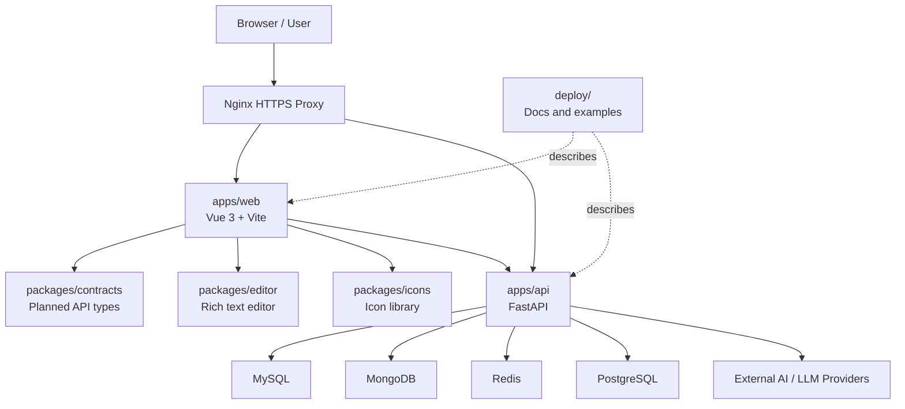

# Project Architecture

本文说明 Sun World 的当前 monorepo 架构、运行边界和后续演进方向。

This document describes the current Sun World monorepo architecture, runtime boundaries, and planned evolution.

## Overview

Sun World is organized as a full-stack monorepo:

- `apps/web` is the public blog frontend.
- `apps/api` is the backend API imported from the previous `blog_end` repository.
- `packages/editor` and `packages/icons` are reusable frontend libraries.
- `packages/contracts` is reserved for shared API contracts and generated types.
- `packages/db` is reserved for a future database/data-access package, but it is not active today.
- `deploy` stores deployment documentation and examples only.
- `docs` stores project context, architecture decisions, and handoff records.

The monorepo branch is a code and context unification step. Production has not yet been cut over to run the backend from `apps/api`.

## High-Level Diagram



## Repository Layers

### Applications

Applications are independently deployable runtime units.

```text
apps/
  web/      # frontend application
  api/      # backend API application
```

`apps/web` owns the browser experience, page routing, UI composition, assets, and frontend service calls.

`apps/api` owns HTTP API routes, authentication, file handling, AI integrations, and database access.

### Packages

Packages are reusable building blocks. They should not own production runtime entrypoints.

```text
packages/
  editor/       # reusable editor package
  icons/        # reusable icon package
  contracts/    # future OpenAPI/types contract package
  db/           # future database package placeholder
```

`packages/contracts` is the preferred next shared layer because the backend is Python and the frontend is TypeScript. It can later hold OpenAPI specs, generated TypeScript types, and API client helpers.

`packages/db` is intentionally inactive. Prisma should only be introduced if a real TypeScript data service or TypeScript backend is added.

### Deployment Docs

```text
deploy/
  frontend/
  backend/
```

The `deploy` directory documents production deployment and future cutover steps. Files under `deploy` are examples and instructions; they are not automatically applied to the server.

## Runtime Architecture

### Current Production

Current production still uses the pre-cutover runtime paths:

- Frontend: Docker container `my-frontend`, built from the production `main` branch.
- Backend: `blog-api.service`, still running from `/home/lighthouse/blog/blog_end`.
- Public domains:
  - `https://sunworld.site` and `https://www.sunworld.site` route to the frontend.
  - `https://api.sunworld.site` routes to the backend API.

### Monorepo Candidate

The migration branch contains the intended target source layout:

- Frontend source: `/home/lighthouse/blog/sun-world/apps/web`
- Backend source: `/home/lighthouse/blog/sun-world/apps/api`
- Future backend cutover target: `blog-api.service` working directory moves to `apps/api`

The backend service should only be cut over after following `docs/architecture/deployment-cutover.md`.

## Frontend Architecture

`apps/web` is a Vue 3 + Vite application.

Responsibilities:

- Render desktop and mobile layouts.
- Render the blog homepage, blog cards, article pages, auth screens, and AI-related screens.
- Call backend API endpoints through frontend service modules.
- Use shared libraries from `packages/editor` and `packages/icons`.
- Keep public filing footer links visible for ICP compliance.

Key boundaries:

- Browser-only secrets must not live in frontend code.
- Public runtime config should use `VITE_` variables and placeholder examples in `.env.example`.
- API response types should eventually come from `packages/contracts`.

Common commands:

```bash
pnpm dev:web
pnpm build:web
pnpm check:web
```

## Backend Architecture

`apps/api` is a FastAPI backend imported from the previous backend repository.

Responsibilities:

- Expose API routes under FastAPI.
- Manage authentication and user-related flows.
- Handle file and media workflows.
- Integrate with AI/LLM providers.
- Encapsulate database access through Python modules.

Current backend data integrations include MySQL, MongoDB, Redis, and PostgreSQL managers.

Key boundaries:

- Secrets stay outside Git and are loaded from server-managed env files.
- Database access should remain behind backend managers or a future data-access layer.
- Runtime cutover must not happen through documentation changes alone.

Common checks:

```bash
pnpm check:api
bash scripts/check-api.sh
```

## Shared Contracts

The recommended near-term shared boundary is API contracts, not a shared database package.

Target direction:

1. Export or generate OpenAPI from FastAPI.
2. Store the reviewed OpenAPI artifact under `packages/contracts`.
3. Generate TypeScript types or a small typed client for `apps/web`.
4. Keep backend implementation details private to `apps/api`.

This creates a clear frontend/backend interface without forcing the Python backend into a TypeScript database stack.

## Data And Configuration Boundaries

Secrets and environment-specific config follow these rules:

- Real `.env` files are ignored by Git.
- `.env.example` files may be committed with placeholders only.
- Server secret paths may be documented, but secret values must not be recorded.
- API keys, passwords, private keys, certificates, cookies, and tokens must never be printed in agent logs or docs.

See `docs/architecture/secrets-and-env.md` for the detailed policy.

## Deployment Boundary

Deployment is deliberately separate from source layout migration.

Safe repository changes:

- Documentation updates
- Build/check scripts
- Monorepo package layout
- Placeholder packages
- Example service files

Production-changing actions:

- Docker rebuilds or container restarts
- `blog-api.service` changes or restarts
- Nginx reloads
- Database migrations or data edits
- Certificate changes

Production-changing actions require a separate deployment/cutover task and verification plan.

## Agent Workflow

Persistent context belongs in repository docs:

- Stable rules: `AGENTS.md`, `CLAUDE.md`, `docs/engineering-conventions.md`
- Environment state: `docs/current-state.md`
- Active handoff: `docs/agent-handoff.md`
- Architecture decisions: `docs/architecture/`

For server-side implementation work, Codex should plan and review while Claude Code can execute routine repository edits through the documented handoff process.

## Evolution Path

Recommended order:

1. Finish review of `monorepo-api-import`.
2. Merge the monorepo source layout to `main`.
3. Keep frontend deployment unchanged until the build path is proven from `apps/web`.
4. Cut over backend runtime to `apps/api` using `docs/architecture/deployment-cutover.md`.
5. Add OpenAPI/type generation in `packages/contracts`.
6. Revisit `packages/db` only if the backend architecture actually needs a TypeScript data layer.

## Related Docs

- `docs/current-state.md`
- `docs/architecture/monorepo-migration.md`
- `docs/architecture/deployment-cutover.md`
- `docs/architecture/secrets-and-env.md`
- `deploy/README.md`
