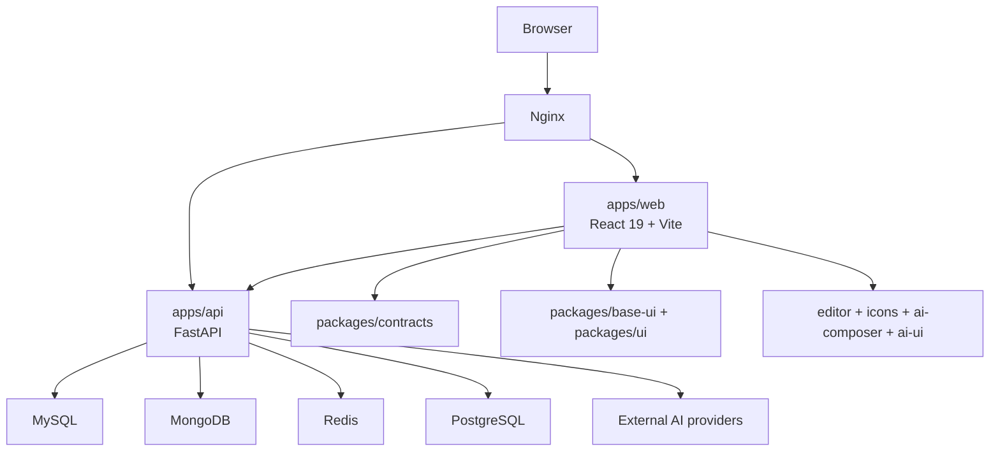

# Project Architecture

本文档描述 Sun World 当前架构。历史迁移记录不应覆盖这里、
`docs/current-state.md` 或 `docs/engineering-conventions.md` 中的现状。

## Runtime overview

Sun World 是一个 pnpm monorepo，生产分支为 `main`：


```mermaid
flowchart TB
  Browser --> Nginx
  Nginx --> Web[apps/web\nReact 19 + Vite]
  Nginx --> Api[apps/api\nFastAPI]
  Web --> Contracts[packages/contracts]
  Web --> UI[packages/base-ui + packages/ui]
  Web --> FeaturePackages[editor + icons + ai-composer + ai-ui]
  Web --> Api
  Api --> MySQL
  Api --> MongoDB
  Api --> Redis
  Api --> PostgreSQL
  Api --> Providers[External AI providers]
```

- `sunworld.site` 与 `www.sunworld.site` 由 Nginx 代理到前端容器
  `my-frontend` 的宿主机 `8081` 端口。
- `api.sunworld.site` 由 Nginx 代理到 `sun-world-api` 容器。
- 后端生产镜像由本仓库 `apps/api` 构建；旧的“尚未切换到 monorepo”描述
  已失效。
- 精确的生产状态、服务名和回滚路径以 `docs/current-state.md` 为准。

## Repository responsibilities

```text
apps/
  web/                 Browser application and public/static rendering
  api/                 FastAPI application and server-owned integrations
packages/
  base-ui/             Upstream-style shadcn/Base UI primitives
  ui/                  Sun World protocols and composed controls
  icons/               Canonical icon data and React icon components
  editor/              Canvas/editor domain library
  ai-composer/         Reusable AI input composer
  ai-ui/               Reusable AI response and workspace UI
  contracts/           OpenAPI artifact, generated types and route constants
deploy/                Deployment documentation and examples
scripts/               Repository quality, generation and operations checks
docs/                  Durable architecture, operations and handoff context
```

Applications own runtime entrypoints. Packages expose reusable contracts or
libraries and must not become hidden application shells. `packages/db` is not an
active runtime boundary and should not be introduced unless a TypeScript data
service creates a real need.

## Frontend dependency direction

`apps/web/src` follows this direction:

```text
main.tsx
  -> app/ (providers, router assembly, top-level errors)
  -> modules/ (business capabilities and route manifests)
  -> shared/ (domain-neutral browser/API/SEO/telemetry infrastructure)
  -> service/ (legacy-compatible HTTP boundary)
  -> store/ (established cross-route client state)
```

- `app` may assemble modules, layouts and shared infrastructure.
- `shared` must not import a business module.
- Modules own their pages, UI, hooks/composables, data adapters and tests.
- Route pages remain lazy-loaded through module manifests.
- Workspace packages are consumed through declared exports, never by reaching
  into another package's `src` directory.
- Generic primitives belong to `@sun-world/base-ui`; product protocols and
  compositions belong to `@sun-world/ui`.
- Icons come from `@sun-world/icons/react`.

The canonical React rules are in `docs/react-development-guidelines.md`.

## Backend boundaries

`apps/api` separates transport, application/domain coordination and storage:

```text
routers/       HTTP validation, auth dependencies and response mapping
controller/    Legacy application managers; migrate cohesive domains gradually
modules/       Newer vertical modules with schemas/repository/service/router
database/      MySQL, MongoDB, Redis and PostgreSQL infrastructure
core/          Cross-cutting errors, auth support, metrics and audit logging
type/          Shared transport schemas still used by legacy managers
```

Rules:

- Routers validate bounded inputs and never construct SQL.
- Dynamic SQL identifiers require a manager-owned allowlist.
- Multi-statement writes use `MySQLUnitOfWork`.
- Secrets and provider credentials remain server-side.
- API request/response types flow through the reviewed OpenAPI artifact in
  `packages/contracts`.
- Cross-store Blog writes (MySQL metadata plus MongoDB content) are not truly
  atomic. A durable outbox or reconciliation job remains the target design.

## Build and quality gates

The root `corepack pnpm check` gate covers formatting, package boundaries,
package tests/builds, Web typecheck/tests/build/SSG/budgets/chunks, API checks
and Compose validation. Frontend bundle budgets live in
`apps/web/performance-budgets.json`.

Use the repository-declared Node and pnpm versions through Corepack. Generated
artifacts must be produced by their checked-in generators rather than edited by
hand.

## Current architectural debt

The following items are deliberately tracked rather than hidden by this
document:

1. `useAiChat.ts`, `ManageLayout.tsx`, `ManageDictionariesPage.tsx` and
   `manageCopy.ts` still have natural extraction boundaries.
2. Some legacy route pages remain under `apps/web/src/pages`; move them only
   when a business module can own the complete vertical slice.
3. Blog metadata/content consistency needs an outbox or reconciliation design
   before production data behavior is changed.
4. Database foreign keys, indexes and normalized unique constraints require an
   audited migration, backup and rollback plan.
5. Historical Vue-era architecture documents remain useful as migration
   records, but they are not current implementation contracts.

## Related documents

- `docs/current-state.md`
- `docs/engineering-conventions.md`
- `docs/react-development-guidelines.md`
- `docs/architecture/frontend-platform-foundation.md`
- `docs/architecture/ai-platform.md`
- `docs/architecture/secrets-and-env.md`
- `docs/agent-handoff.md`
