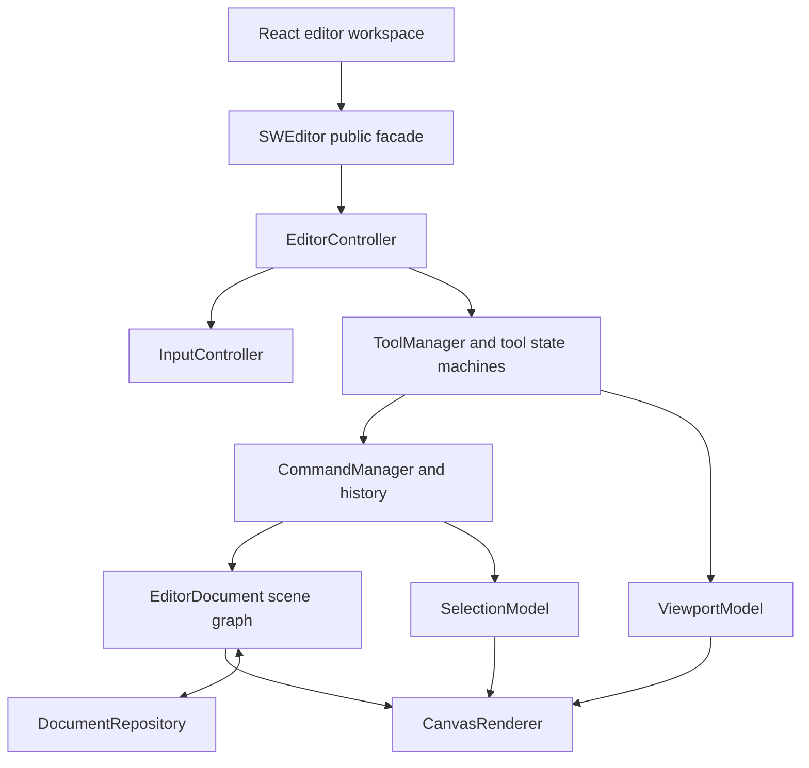

# Figma-Like Editor Foundation Design

## Summary

Evolve `@sun-world/editor` from a working Canvas prototype into a dependable,
framework-neutral foundation for a Figma-like editor. The first delivery keeps
Canvas 2D, the existing React workspace, and the package's public facade, while
replacing prototype-era coupling with explicit document, selection, input,
history, rendering, and persistence boundaries.

This phase establishes the architecture required for later Figma-style
features. It does not attempt multiplayer collaboration, vector path editing,
Auto Layout, components, or server-side version history.

## Goals

- Preserve the framework-neutral `@sun-world/editor` package and the existing
  `/canvas` React route.
- Make editor creation and destruction leak-free across repeated route mounts.
- Provide a single pointer and keyboard input pipeline.
- Model the editable scene separately from transient selection state.
- Route document mutations through reversible commands.
- Support undo and redo for element creation, deletion, movement, resizing,
  rotation, reparenting, and property changes.
- Complete single selection, additive selection, marquee selection, and clear
  selection behavior.
- Make selection handles participate in hit testing, resizing, and rotation.
- Make persistence injectable and document-scoped instead of relying on one
  process-wide local-storage key.
- Verify behavior with package-level unit tests, React adapter tests, project
  checks, production builds, and browser interaction checks.

## Non-Goals

- Multiplayer cursors or CRDT/OT synchronization.
- Pen, Bézier, boolean, or freehand vector tools.
- Auto Layout or constraint-based layout.
- Reusable components and component instances.
- Server-side persistence or version history.
- Pixel-perfect reproduction of the complete Figma user interface.

## Chosen Approach

Use an incremental kernel refactor. Existing geometry, matrix, Canvas rendering,
and React integration remain available while responsibilities move behind
focused interfaces. Each migration step must leave `/canvas` runnable and must
be covered by tests before the next responsibility is moved.

A clean-room rewrite was rejected because it would discard useful geometry and
rendering behavior without producing earlier user value. Adopting Konva or
Fabric was rejected because the project goal is to develop and understand its
own editor engine rather than wrap a third-party scene editor.

## Architecture



### Public Facade

`SWEditor` remains the application-facing entry point. It owns the editor
session and composes all internal services. Consumers receive commands and
subscriptions rather than direct access to mutable stores.

The facade exposes tool selection, document loading/saving, selection commands,
element updates, zoom, undo/redo, capability state, and disposal. Existing
public methods used by the React adapter remain compatible while the migration
is in progress.

### EditorDocument

`EditorDocument` is the authoritative persistent scene graph. It owns element
identity, parent-child ordering, and document serialization. It does not own
selection, marquee rectangles, DOM state, rendering, or storage APIs.

Document operations enforce these invariants:

- The root node cannot be deleted or reparented.
- Every non-root element has one existing parent.
- An element cannot be reparented into itself or one of its descendants.
- Sibling ordering is explicit and stable.
- Import either validates the complete snapshot or leaves the current document
  unchanged.
- Exported snapshots contain only persistent document data.

### SelectionModel

`SelectionModel` owns selected IDs, the marquee rectangle, the combined
selection bounds, and the active transform handle. It references document IDs
but does not mutate document elements.

Selection order is deterministic. Removing an element also removes its subtree
from selection. Locked or invisible elements are excluded from pointer and
marquee selection unless a future explicit layer-panel operation says otherwise.

### Commands and History

Every user-visible document mutation is represented by an `EditorCommand` with
`execute()` and `undo()` behavior. `CommandManager` owns undo and redo stacks and
publishes `canUndo` and `canRedo` changes.

Continuous pointer transforms create one history entry per completed gesture,
not one entry per pointer-move event. A new command after undo clears the redo
stack. Failed commands do not enter history or partially modify the document.

The first command set covers:

- Add element.
- Delete selected elements as restorable subtrees.
- Update element properties.
- Transform one or more elements.
- Reparent/reorder elements.

### InputController

One `InputController` owns all DOM listeners and current modifier/button state.
It uses Pointer Events and pointer capture for drawing and transformations that
continue outside the Canvas bounds. Wheel and keyboard shortcuts use the same
input state.

Keyboard commands are active only while the editor workspace is focused or owns
the active pointer interaction. Text and numeric inputs retain normal editing
behavior; editor shortcuts must not delete layers or intercept typing while a
form field is active.

`dispose()` removes every Canvas, window, and document listener and releases any
active pointer capture. Repeated mount/unmount cycles must not accumulate input
handlers.

### Tools

`ToolManager` maintains one active top-level tool. Tools consume an immutable
context of service interfaces rather than the concrete `SWEditor` class.

The select tool becomes an explicit interaction state machine:

```text
idle -> marquee
idle -> moving-selection
idle -> resizing-selection
idle -> rotating-selection
gesture -> commit command -> idle
gesture -> cancel and restore initial snapshot -> idle
```

The comment tool remains visibly unavailable until it has real comment behavior;
it must not masquerade as a second pan tool.

### Viewport and Coordinates

`ViewportModel` remains a 2D affine transform and is the only authority for
screen/world conversion. Pointer coordinates are derived from the Canvas client
rectangle rather than relying on inconsistent `offsetX`/`offsetY` behavior.

Panning and zooming affect viewport state but not document history. Zoom-at-point
keeps the world coordinate beneath the pointer stable. Viewport notifications
are coalesced into animation-frame rendering.

### Rendering

`CanvasRenderer` is a projection of document, selection, and viewport state. It
does not mutate those models. Rendering is invalidation-driven and coalesced to
at most one frame at a time.

The frame order is:

1. Clear the device-pixel-aware Canvas.
2. Apply the viewport transform.
3. Render visible document nodes in scene order.
4. Render marquee and selection bounds.
5. Render transform handles in screen-consistent sizes.
6. Render rulers and other non-document overlays.

Handle hit testing shares the same generated geometry used for drawing, so
visual and interactive handle positions cannot drift apart.

### Persistence

Persistence is accessed through a `DocumentRepository` interface:

```ts
interface DocumentRepository {
  load(documentId: string): Promise<EditorDocumentSnapshot | null>
  save(documentId: string, snapshot: EditorDocumentSnapshot): Promise<void>
}
```

The default browser implementation uses a versioned local-storage key containing
the document ID. Tests use an in-memory implementation. Repository failures are
reported to the application and do not corrupt the active in-memory document.

Legacy `editor-data` snapshots are imported once into the default document when
valid; invalid legacy data is ignored without preventing editor startup.

## Application Integration

`useEditorCanvas` remains the React boundary. It subscribes to immutable editor
snapshots and exposes stable callbacks for the workspace. Its UI-facing state
adds `canUndo`, `canRedo`, and selected element attributes while keeping engine
objects out of React state.

The first workspace update adds undo and redo controls, accurate active-tool
feedback, multi-selection feedback, and property editing through commands. The
layer tree continues to select nodes and will support modifier-based additive
selection and command-backed reordering in the same foundation phase.

## Error Handling

- Invalid document operations return typed failures and perform no mutation.
- Import validates version, element IDs, parent references, and cycles before
  replacing the current document.
- Command execution rolls back its partial work before returning a failure.
- Persistence errors are observable but do not clear history or active state.
- Disposal is idempotent.
- Unknown tool names and transform handles are rejected without changing the
  active interaction.

## Testing and Verification

Development follows red-green-refactor. Each new behavior first receives a test
that fails for the expected missing behavior.

Package-level tests cover:

- Document invariants, serialization, reparenting, and subtree restoration.
- Selection semantics and bounds.
- Command execute/undo/redo behavior and redo invalidation.
- Input focus scoping, pointer capture, and complete disposal.
- Coordinate conversion and zoom-at-point invariants.
- Select-tool gesture transitions and one-command-per-gesture history.
- Transform-handle geometry and hit testing.
- Repository document isolation and legacy migration.

Application tests cover adapter subscriptions, cleanup, command forwarding, and
toolbar capability state. The final verification runs the editor package tests,
editor package build, Web tests and type checking, the repository's narrowest
complete Web check, formatting, and `git diff --check`.

Browser verification exercises `/canvas` at desktop and mobile-compatible
viewport sizes: create rectangles, single/multi/marquee select, move, resize,
rotate, undo/redo, layer selection, property updates, save/reload, shortcut focus
safety, and route leave/re-enter behavior. Console errors and duplicate-event
symptoms are treated as failures.

## Delivery Sequence

1. Establish tests and fix editor lifecycle/input ownership.
2. Extract `EditorDocument` and `SelectionModel` behind compatibility methods.
3. Add command history and migrate mutations to commands.
4. Complete selection gestures and transform handles.
5. Introduce document-scoped repositories and legacy migration.
6. Upgrade the React workspace controls and layer/property integration.
7. Run complete automated and browser verification, then update durable project
   state and handoff documentation.

Each sequence item must leave the editor usable and independently verifiable.

